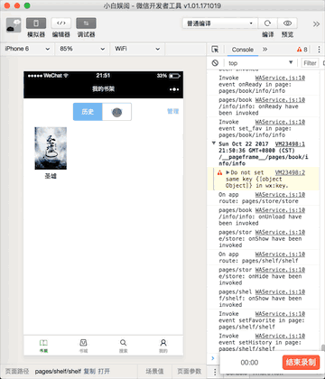

小白娱阅
====
微信小程序, 小说阅读, 欢迎大家对小白娱阅提出功能和贡献代码.

### 开发与后台支持
- python flask 提供小程序api。
- scrapy 提供小说的爬取部分。

### 效果预览

 

### 已开发
1. 收藏小说, 显示阅读过的小说, 并提供管理。
2. 从商城展示所有小说, 并提供下拉更新操作。
3. 搜索页面提供关键字查询, 并提供历史查询, 提供清空公共。
4. 小说信息页面可以查看小说详细信息, 提供收藏功能, 添加查看评论, 评论的下拉更新。
5. 小说目录页, 提供排序方式, 翻页功能, 选择页面功能。
6. 小说章节页面提供上一章, 下一章阅读。 提供字体大小, 夜间模式的修改, 以及返回目录和跳转到主页。

### 待开发
1. 商城提供排行, 分类, 推荐等功能。
2. 搜索页面, 提供热门搜索, 小说关键字预览等功能。
3. 用户页面提供, 对小说推荐, 邀请好友, 联系客服, 留言(输入想看的小说)。
4. 小说详情页提供推荐小说功能。

### 最后
最后欢迎大家来贡献代码和提出有意思的功能。
